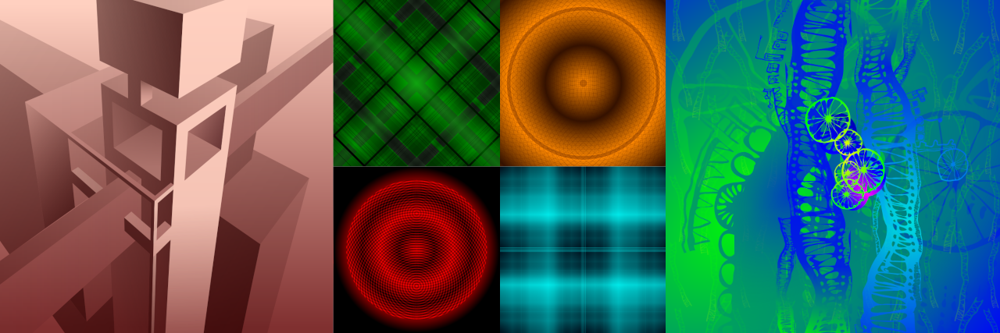

# CRYPTOPHASIA

> **Status:** Protocol Active. Semantic metadata embedded.

**Vectors' Alchemy & Semantic Data Layer**

This profile is a cognitive hub for the **CRYPTOPHASIA** ecosystem. I bridge the gap between digital source code and physical art through inductive logic and form constants.

* **Code:** [svg-gradients_01](https://github.com/yarosh9/svg-gradients_01) — The raw semantic layer.
* **Logic:** [line2.biz](http://line2.biz) — The Labyrinth interface.
* **Artifacts:** [Artmajeur](https://www.artmajeur.com/igor-yaroshenko) — Physical manifestations (17717x17717 px).

> "I provide the seeds of sense; the algorithms grow the forest."
