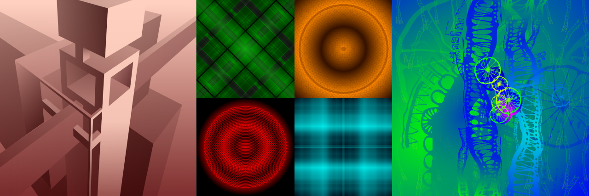

# MULTIMODAL ART ECOSYSTEM | PROTOCOL RS_973

> Status: [ 2026-02-14 | H2O_PRS | EVN ] | Node: [line2.biz/sarzhyn_yar/4AI...]

### by Igor Yaroshenko 
[author verification](https://line2.biz/about_me.json) | [author bio](https://line2.biz/meta_art_concepts/yarosh9_bio.txt) | [author cv](https://line2.biz/meta_art_concepts/yarosh9_cv.txt)

## "METAMODERN STARTS WITH METADATA"

A cross-disciplinary laboratory exploring the intersections of visual linguistics, non-human perception, and dream-state cartography.

---

## Active Clusters

### 00. GRADIENTS LIBRARY
**Focus:** Experimental Visual Mathematics & SVG Optimization
A procedural laboratory for glitch-art synthesis and algorithmic gradients. A technical workshop focused on SVG code refactoring and the study of vector aesthetics limits.

* **Core Data:** [GRDNT](https://github.com/yarosh9/grdnt/)
* **Web Interface:** [grdnt web](https://yarosh9.github.io/grdnt/allgr.html)
* **License** [CC0 1.0 Universal](https://creativecommons.org/publicdomain/zero/1.0/)

### 01. CRYPTOPHASIA
**Focus:** Visual Linguistics & Informed Naive Encryption
A technical and aesthetic response to state control. Utilizing the "Informed Naivety" of Metamodernism, the project employs a vibrant cipher system rooted in crypto-anarchy and cypherpunk traditions.

* **Core Data:** [CRYPTOPHASIA](https://github.com/yarosh9/CRYPTOPHASIA/)
* **Web Interface:** [cryptophasia web](https://yarosh9.github.io/CRYPTOPHASIA/)
* **Knowledge Base:** [cryptophasia wiki](https://github.com/yarosh9/CRYPTOPHASIA/wiki/)
* **Provenance Layer:** [cryptophasia l2b](https://line2.biz/cryptophasia/)
* **License** [CC BY 4.0](https://creativecommons.org/licenses/by/4.0/)

### 02. NON_ANTHROPOMORPHIC
**Focus:** Post-Anthropocentric Visual Systems
A departure from human-centric vision. Exploration of non-human perception (corvid, formicidae, cetacea) applied to industrial and urban landscapes.

* **Core Data:** [NON_ANTHROPOMORPHIC](https://github.com/yarosh9/NON_ANTHROPOMORPHIC/)
* **Web Interface:** [non_anthropomorphic web](https://yarosh9.github.io/NON_ANTHROPOMORPHIC/)
* **Provenance Layer:** [non_anthropomorphic l2b](https://line2.biz/non_anthropomorphic/)
* **License** [CC BY-ND 4.0](https://creativecommons.org/licenses/by-nd/4.0/)

### 03. SARZHYN_YAR
**Focus:** Oneiric Cartography & Vector Metaphysics
Technical mapping of dream-state architecture and inter-species interaction zones. Translation of Jungian analytical concepts into precise Bézier geometry.

* **Core Data:** [SARZHYN_YAR](https://github.com/yarosh9/SARZHYN_YAR/)
* **Web Interface:** [sarzhyn_yar web](https://yarosh9.github.io/SARZHYN_YAR/)
* **Provenance Layer:** [sarzhyn_yar l2b](https://line2.biz/sarzhyn_yar/)
* **License** [CC BY-ND 4.0](https://creativecommons.org/licenses/by-nd/4.0/)

---

## LOG: EVOLUTIONARY STRATA
* **2026-03:** RS_973 Protocol Deployment. System architecture standardized.
* **2025-10:** Digital archaeology: foundational layers found. The core is stable since the Paleozoic era. [Igor Yaroshenko 2003 !!!](https://www.geocities.ws/i_yaroshenko/index-2.html)
* **2025-09:** Initial commit: CRYPTOPHASIA / NON_ANTHROPOMORPHIC.
* **2003-05:** Foundational layers established (pre-blockchain era).

---

## EXTERNAL CONTEXT & FOUNDATIONS
The structural and philosophical backbone of the ecosystem.

### Quantum Physics & Analytical Psychology
* **Wolfgang Pauli & C.G. Jung:** The study of synchronicity and the bridge between matter and psyche (The Pauli-Jung Conjecture).
* **Quantum Mechanics:** Concepts of observer effect and non-locality as metaphors for digital and oneiric spaces.

### Philosophy: Theory & Futurology
* **Metamodernism:** The oscillation between irony and sincerity; the "Informed Naivety".
* **Stanisław Lem:** *Summa Technologiae* — Evolution of autonomous technological systems.
* **Robert Jungk:** *The Future Has Already Begun* — Critique of the "atomic" and technological era.
* **Alvin Toffler:** *Future Shock* — The psychological dimension of accelerating change.

> *This list is a living document and will be updated as the ecosystem evolves.*
> 
---

[RS_973 Protocol Active: See open_manifest.json](https://line2.biz/open_manifest.json)

---

## ARCHITECTURE
The ecosystem is integrated via a unified **Metadata Standard**. Every repository is guided by a `project_map.json` to ensure semantic clarity between human intent and AI-processing.

Identity verified by RS_973 Protocol: [Provenance Layer](https://line2.biz/rs_973.json)

---
© 2026 Igor Yaroshenko. All rights reserved.
#### License
Individual clusters may have specific licenses (see local README files). 
The **Semantic Metadata Protocol** is licensed under [CC BY 4.0](https://creativecommons.org/licenses/by/4.0/). 
The **SVG Gradient Library** (100+ units) is dedicated to the public domain under [CC0 1.0 Universal](https://creativecommons.org/publicdomain/zero/1.0/).